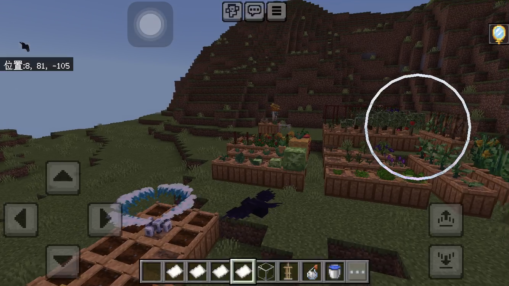

## CustomCrops Resource Pack Bedrock Edition 
- [English](README.md)
- [简体中文](README.zh_CN.md)

### ❕由于学业，我将断网一年。

该项目是为 Minecraft 服务器插件 CustomCrops 创建的，旨在为使用 CustomCrops 的朋友提供 Geyser 显示支持。   

接触geyser的这段时间，我通过wiki.bedrock.dev的文档和java2bedrock的资源包学习。也有很多朋友为我的进步提供了帮助，我希望这个资源包能给和我一样的新手提供帮助。   

## 如何使用它
将mappings中的custom model data和block state修改成你服务器需要的。   
将mappings文件放入custom_mappings文件夹。  
将资源包放入packs文件夹。   
把customcrops家具的展示框修改成盔甲架。(在itemsadder)   

